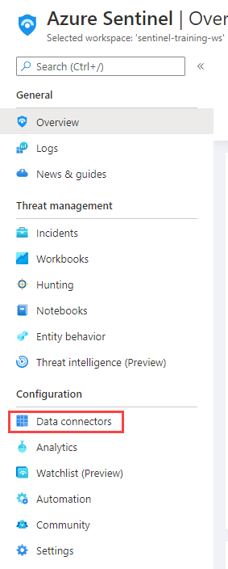
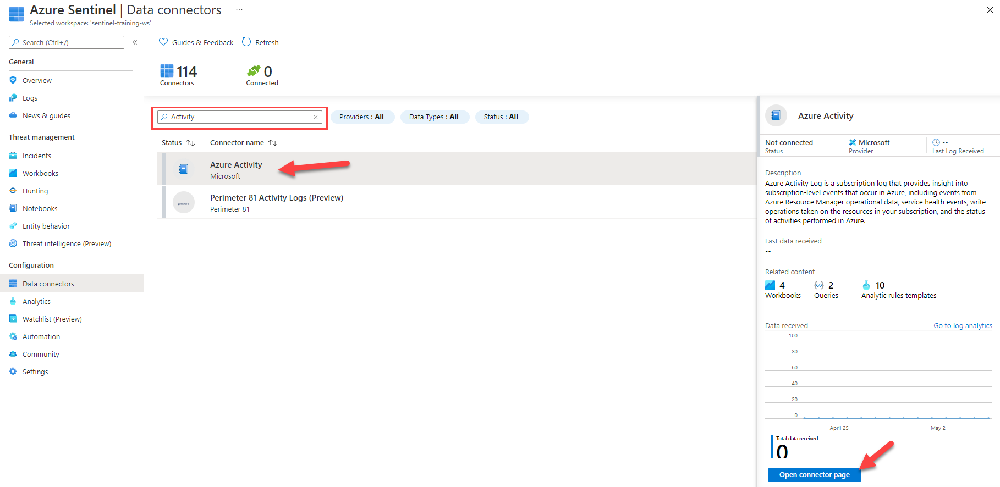
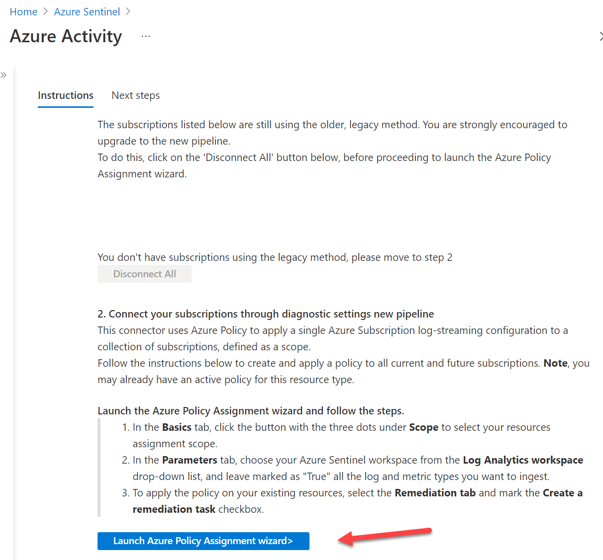
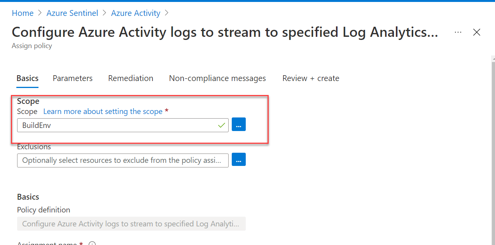
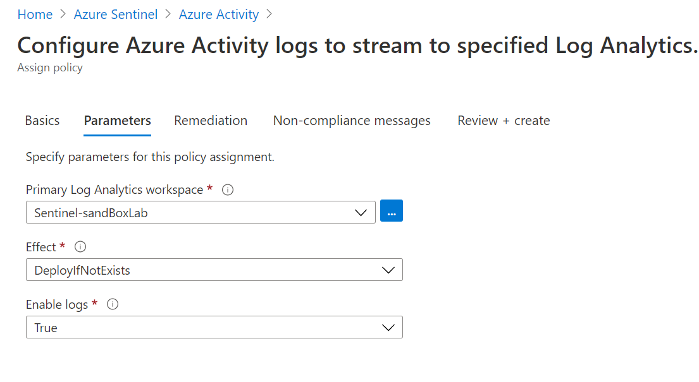
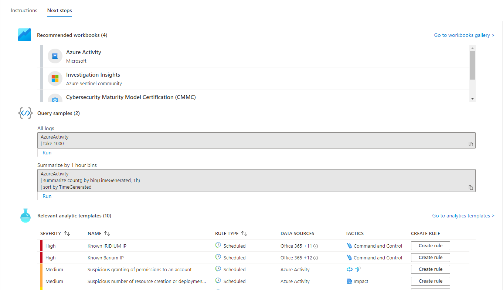
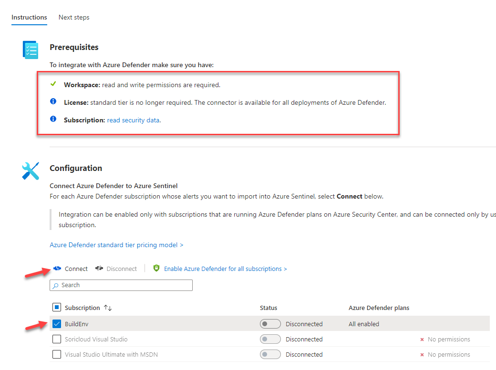
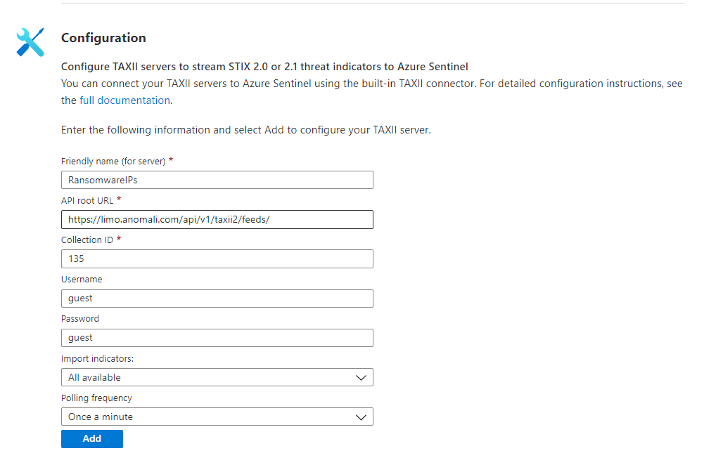

# M2: Data Connectors

## Objectives

In this module you will learn how to enable Data Connectors in Microsoft Sentinel to bring alerts and/or telemtry from different sources.

#### Prerequisites

This module assumes that you have completed [Module 1](Module-1-Setting-up-the-environment.md), as you will need an Microsoft Sentinel workspace provisioned.

Some of the data connectors that will be used in this lab, require some specific permissions on the workspace or your azure subscription. If you don't have the appropriate permissions, you can still continue doing the rest of the labs.

### Exercise 1: Enable Azure Activity data connector

This exercise shows you how to enable the Azure Activity data connector. This connector will bring into your Microsoft Sentinel workspace all the audit events for actions performed in your Azure subscription.

**NOTE**: To do this exercise, your user must have Reader permissions to any subscription which logs you want to stream into Microsoft Sentinel.

1. Go to you Microsoft Sentinel workspace and select **Data Connectors** under **Configuration** section.

1. In the data connectors screen, type **actvity** in the search bar, select the **Azure Activity** connector and click on **Open connector page**.

1. In the Azure Activity connector page, go to option number 2 **Connect your subscriptions through diagnostic settings new pipeline**. This method leverages Azure Policy and it brings many improvements compared to the old method (more details about these improvements can be found [here](https://techcommunity.microsoft.com/t5/azure-sentinel/moving-azure-activity-connector-to-an-improved-method/ba-p/2479552)).
2. Click on the **Launch Azure Policy Assignment wizard**, this will redirect you to the policy creation page.

On the Scope selection select your relevant subscription.

**NOTE**: Please note that if you have owner permission on a management group level, you can assign this policy to configure collection of Azure Activity logs form all the subscriptions under the management group.

1. Go to the **Parameters** tab. On the **Primary Log Analytics workspace** select the Microsoft Sentinel workspace:

1. Press **Review and Create** to save this policy and **Create**.
2. Click on **Next Steps**. Here you see what content is available for the telemetry that is brought into Sentinel by this connector, like Workbooks, Query samples and Analytics Rules.

1. It is normal if you don't immediately see the connector showing as connected and in green. Also, each subscription has a maximum of 5 destinations for its activity logs. If this limit is already reached, the policy created as part of this exercise won't be able to add an additional destination to your Microsoft Sentinel workspace.

### Exercise 2: Enable Microsoft Defender for Cloud data connector

This exercise shows you how to enable the Microsoft Defender for Cloud data connector. This connector allows you to stream your security alerts from Microsoft Defender for Cloud into Microsoft Sentinel, so you can view Defender data in workbooks, query it to produce alerts, and investigate and respond to incidents.

**NOTE**: To do this exercise, your user must have the Security Reader role in the subscription of the logs you stream. If not done already, you will need to enable any of the Defender plans in Microsoft Defender for Cloud.

1. Go to you Microsoft Sentinel workspace and select **Data Connectors** under _Configuration_ section.
2. In the data connectors screen, type _defender_ in the search bar, select the _Microsoft Defender for Cloud_ connector and click on _Open connector page_.
3. In the Microsoft Defender for Cloud connector page, check that your permissions are enough at the top. If you don't have the required permissions, you can continue to the next exercise.
4. From the list of subscriptions at the bottom of the page, select the desired subscription an click on _Connect_. Wait for the operation to complete.

1. Click on _Next Steps_ at the top of the page and explore what content is available for this connector.

### Exercise 3: Enable Threat Intelligence TAXII data connector \[Until We have a License from the TAXII Vendor, we cant Complete this exercise ]

**Connecting Microsoft Sentinel to Pulsedive TAXII Server**

To connect Microsoft Sentinel to Pulsedive’s TAXII Server, obtain the API Root, Collection ID, Username and Password from Pulsedive.

&#x20;

Obtain access to Pulsedive via Microsoft Sentinel by following these steps:

* Create a free Pulsedive account at [pulsedive.com/register](https://pulsedive.com/register)
* Upgrade to the [Feed plan](https://pulsedive.com/api/taxii) that best suits your requirements
  * More information on the Pulsedive Feed service can be found [here](https://pulsedive.com/about/feed)
* Configure the TAXII client in Sentinel with the following information:
  * API root: [https://pulsedive.com/taxii2/api/](https://pulsedive.com/taxii2/api/)
  * Indicator collection ID: a5cffbfe-c0ff-4842-a235-cb3a7a040a37
  * Username: taxii2
  * Password: your API key, which can be found on your [account](https://pulsedive.com/account) page
* Visit Pulsedive’s TAXII [documentation](https://pulsedive.com/api/taxii) to learn more

_**Sample Screenshot**_

1. Click _Add_ and wait until the operation completes.
2. Click on _Next Steps_ at the top of the page and explore what content is available for this connector. In a few seconds, the ThreatIntelligenceIndicator will be populated with IOCs from Anomali's feed.

You can now continue to [**Module 3 - Analytics Rules**](broken-reference)
