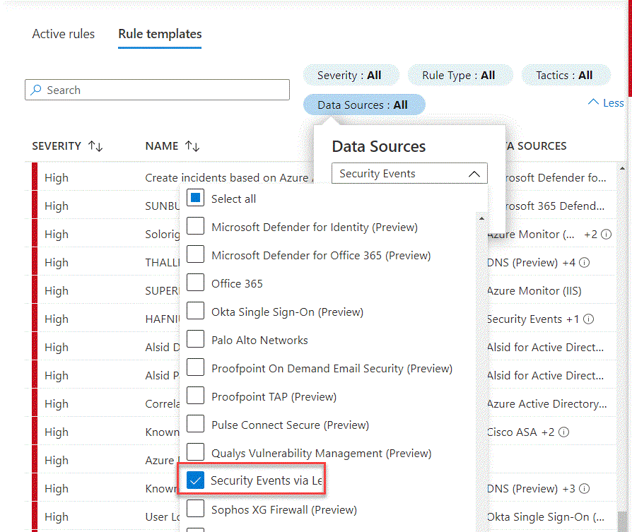
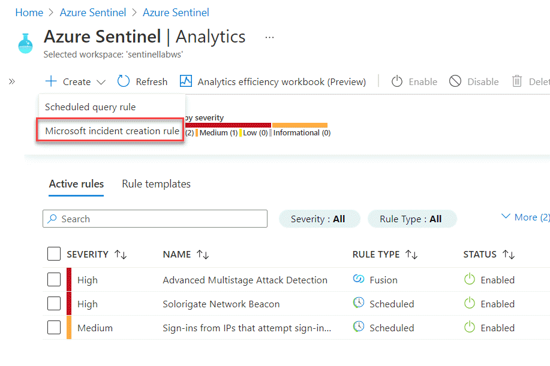
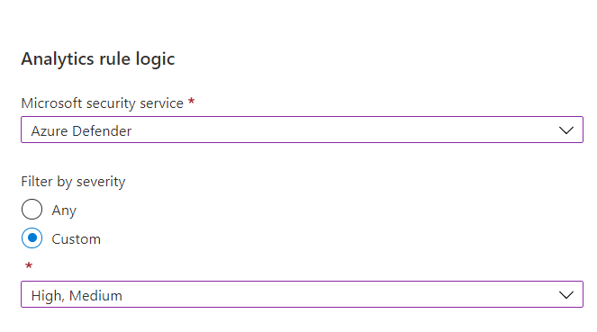
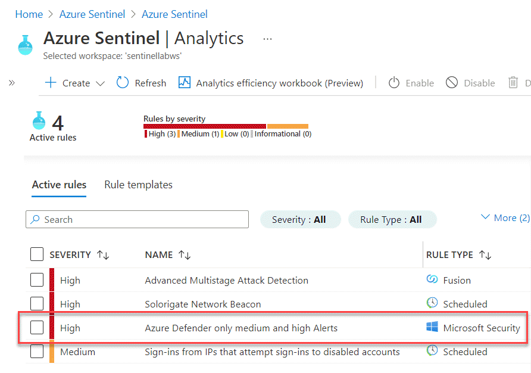
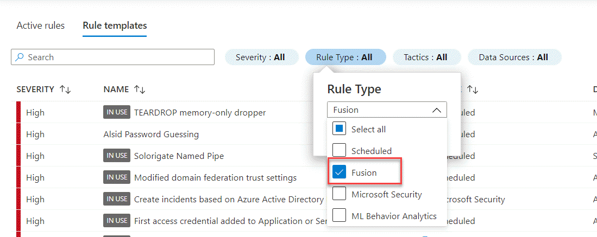
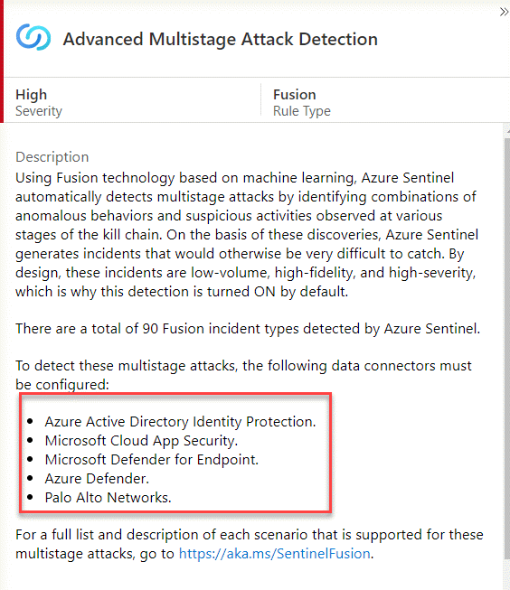
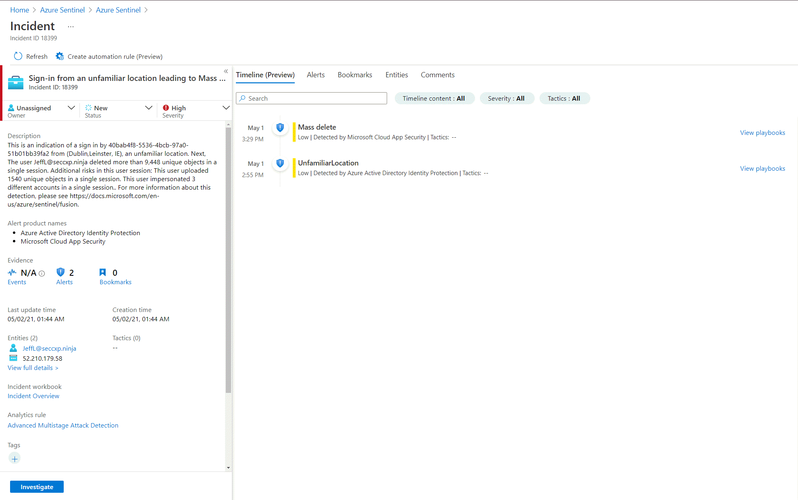
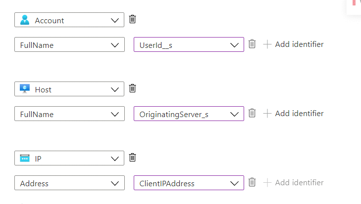

# Analytics Rules

## Objectives

This module guides you through the Analytics Rule part in Microsoft Sentinel, and shows you how to create diffrent type of rules (Security Detections)

#### Prerequisites

This module assumes that you have completed [Module 1](Module-1-Setting-up-the-environment.md), as the data and the artifacts that we will be using in this module need to be deployed on your Microsoft Sentinel instance.

### Exercise 1: Analytics Rules overview

1. Open your newly created Microsoft Sentinel instance.
2. On the left menu navigate to analytics and select **Rule template** section
3. Review the analytics rules templates that ship with the product.
4. On the analytics rule filter select **Data sources** and check **security Event**, review all the analytic rules on the above data source.



1. In the rule search bar type **Rare RDP Connections** for the rule name.
2. To review the rule logic and possible configuration options, in the right lower corner press **create rule**
3. Review the rule defintion like tactics and severity.
4. Press **Next: Set rule logic** in the bottom of the page
5. in the rule logic screen, you have the ability to create or modify the rule KQL query, control of the entity mapping and define the scheduling and lookback time range.
6. After you reviewed the rule configuration options, close this page and navigate back to the main Microsoft Sentinel Overview screen

### Exercise 2: Enable Microsoft incident creation rule

Microsoft Sentinel is a cloud-native SIEM and as such, it acts as single pane of glass for alerts and event correlation. For this purpose, and to be able to ingest and surafce alerts from Microsoft Security Products, we create a **Microsoft incident creation rule**. In this exercise, we will review this feature and create one example rule with a filtering option to help the analyst deal with alert fatigue.

1. In Microsoft Sentinel main page press on the **Analytics** section.
2. In the top bar press on **+Create** and select **Microsoft incident creation rule**



1. In the rule name enter **"Azure Defender only medium and high Alerts"**
2. In the **Microsoft security service** dropdown select **Azure Defender**
3. In the **Filter by severity** select **custom** and mark **High** and **Medium**



1. Press **Next: Automated response**
2. In the above **"Automated response"** page you can attach automation rule that can generate automation tasks that can assist your SOC with repetitive tasks, or Security remediation. More in this topic in the SOAR module.
3. Press **Next: Review** and **create** in the next page.



### Exercise 3: Review Fusion Rule (Advanced Multistage Attack Detection)

Fusion rule is a unique kind of detection rule. With Fusion rule, Microsoft Sentinel can automatically detect multistage attacks by identifying combinations of anomalous behaviors and suspicious activities That are observed at various stages of the kill-chain.

In this exercise we will learn how to distinguish and review **Fusion rule** in Microsoft Sentinel.

1. In the analytics page rule template tab, use the **Rule Type** filter and select **Fusion**



1. In the template screen notice the tag **IN USE** as this rule template enabled by default.
2. Press on the rule and review the data sources in the rule right pane.



As Fusion rules produce security incidents with high fidelity and simulation can be challenging, we are adding an example of an incident that was created from fusion detection.

In the below example we are seeing 2 low severity alerts from **Azure Active Directory Identity Protection** and **Microsoft Cloud App Security** that stich together into high severity incidence:



### Exercise 4: Create Microsoft Sentinel custom analytics rule

Your Security consult notify you about this thread&#x20;


Exercise


&#x20;Base on the attack vector and the organization risk he recommend you to create detection rule for this malicious activity. In this exercise you will use Microsoft Sentinel analytics rule wizard to create new detection.

1. Review the article in the above link and understand what is the data source that will be part of the detection.
2. Check if this operation are capture as part of your collection strategy:

* In the left menu press on the **Logs** and navigate to the search canvas

**important note: in this lab we are using custom logs that replace the Out-off-the-box tables**

*   Run the search query below to see the list of activities Microsoft Sentinel captured in the last 24hr

    ```powershell
    OfficeActivity_CL
    | distinct Operation_s
    ```
* As you can see the **New-InboxRule** operation is indeed captured in your logs.


1. In the analytics rule page, in the top bar press on **+Create** and select **scheduled query Rule**
2. In this screen we will add general information regarding this rule.
3. In the **Name** type **"Malicious Inbox Rule - custom"**.
4. In the rule **Description** add **This rule is detecting on delete all traces of phishing email from user mailboxes**.
5. In the **Tactics** select **Persistence** and **Defense Evasion**.
6. In the rule **severity** select **medium**.
7. Press **Next: SET rule logic**.
8. In the **Rule logic** page, review and copy the above query

```powershell
let Keywords = dynamic(["helpdesk", " alert", " suspicious", "fake", "malicious", "phishing", "spam", "do not click", "do not open", "hijacked", "Fatal"]);
OfficeActivity_CL
| where Operation_s =~ "New-InboxRule"
| where Parameters_s has "Deleted Items" or Parameters_s has "Junk Email" 
| extend Events=todynamic(Parameters_s)
| parse Events  with * "SubjectContainsWords" SubjectContainsWords '}'*
| parse Events  with * "BodyContainsWords" BodyContainsWords '}'*
| parse Events  with * "SubjectOrBodyContainsWords" SubjectOrBodyContainsWords '}'*
| where SubjectContainsWords has_any (Keywords)
or BodyContainsWords has_any (Keywords)
or SubjectOrBodyContainsWords has_any (Keywords)
| extend ClientIPAddress = case( ClientIP_s has ".", tostring(split(ClientIP_s,":")[0]), ClientIP_s has "[", tostring(trim_start(@'[[]',tostring(split(ClientIP_s,"]")[0]))), ClientIP_s )
| extend Keyword = iff(isnotempty(SubjectContainsWords), SubjectContainsWords, (iff(isnotempty(BodyContainsWords),BodyContainsWords,SubjectOrBodyContainsWords )))
| extend RuleDetail = case(OfficeObjectId_s contains '/' , tostring(split(OfficeObjectId_s, '/')[-1]) , tostring(split(OfficeObjectId_s, '\\')[-1]))
| summarize count(), StartTimeUtc = min(TimeGenerated), EndTimeUtc = max(TimeGenerated) by  Operation_s, UserId__s, ClientIPAddress, ResultStatus_s, Keyword, OriginatingServer_s, OfficeObjectId_s, RuleDetail
```

1. we can view the rule creation estimatin by pressing **Test with current data** in the right side and see the number of hits.
2. Under the **Alert enrichment (Preview)**, expand the entity mapping section that will allow us to map our fields to well-known categories:
   * In the **Entity type** open the supported list of entities and select **Account** in the identifier select **FullName** and map it to **UserId\_\_s**
   * Press **+ Add new entity** and this time select **Host** entity in the identifier select **FullName** and map it to **OriginatingServer\_s**
   * Press **+ Add new entity**, select **IP** entity, in the identifier select **Address** and map it to **ClientIPAddress** value.

Your mapping should look like the above:



To make your SOC more productive, save analyst time and effectively triage newly created incidents, your SOC analyst ask you to add the affected user from the search results as part of the alert title.

1. For applying this request, we will use the **Alert details** feature and create custom **Alert Name Format**

* In the **Alert Name Format** copy the above dynamic title **"Malicious Inbox Rule, affected user \{{UserId\_\_s\}}"**

1. In the **Query scheduling** set the **run query every** to **5 minutes** and the **Lookup data to last 12 Hours** (This scheduling might not be ideal for production environment and should be tune). If you deployed the lab more than 12 hours ago, you will need to change the lookback period.
2. In the **Suppression** leave it on **Off**
3. Press the **Next:Incident settings(Preview)**
4. As your SOC is under stress, we want to reduce the number of alerts and be sure that when analyst handle a specific incident, he/she will see all related events or other incidents related to the same attack story. For that we will **implement Alert grouping** feature. To do so, follow the steps below:

* In the **Incident settings (Preview)** under **Alert grouping** change it to **Enabled**.
* Modify the **Limit the group to alerts created within the selected time frame** to **12 hours**.
* Select the **Grouping alerts into a single incident if the selected entity types and details matches** and select the Account.

1. Press the **Next: Automated response** and also press **Next:Review** and create this newly analytics rule.

### Exercise 5: Review resulting security incident

After we created the custom analytics rule that detect us for malicious inbox rule rules. Let's review the incident that was created from this analytics rule.

1. On the main Microsoft Sentinel main page, select **incidents** and review the incident page
2. Locate a new incident with title **"Malicious Inbox Rule, affected user AdeleV@contoso.OnMicrosoft.com"** notice that the name adapt and the effected user name added to the incident name.
3. In the right pane we can review the incident preview, this view will gave us high level overview on the incident and the entity that related to it.
4. Press on the **"view full details"**


1. In the incident full details page you are able to see alert timeline (effective when you have more than one alert in a given incident)
2. Check the top level tabs and press on the entity tab, this section will expose all the mapped entities that related to this incident.


1. press on the entity **"AdeleV@contoso.OnMicrosoft.com"** this action will navigate us to the user entity page, this page will give us holistic view on the user entity, with all its activity and related alerts.

You can now continue to [**Module 4 - Incident Management**](Module-4-Incident-Management.md)
