# Incident Management

This module guides you through the SOC Analyst experience using Microsoft Sentinel's incident management capabilities.

#### Prerequisites

This module assumes that you have completed [Module 1](Module-1-Setting-up-the-environment.md), as the data and the artifacts that we will be using in this module need to be deployed on your Microsoft Sentinel instance.

### Exercise 1: Review Microsoft Sentinel incident tools and capabilities

As a SOC analyst, the entry point to consume Security incidents (tickets) in Sentinel is the Incident page.

1. In the left navigation menu click on _Incidents_ to open the incidents page. This page will show by default all the open incidents in the last 24hr.
2. When we want to change the time window, present only incident from specific severity or to see also closed incident, we can use the filters bar:

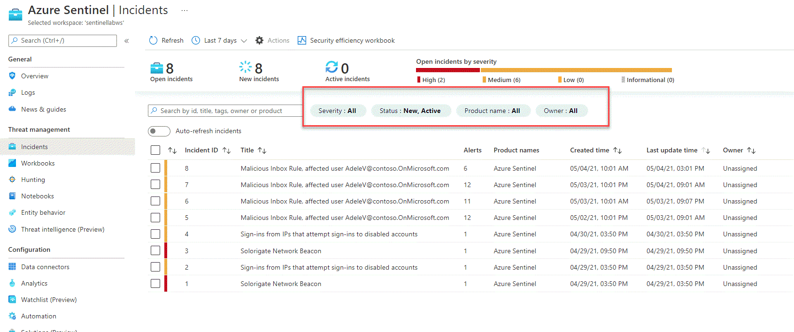

3. On the incident page select the _Sign-ins from IPs that attempt sign-ins to disabled accounts_ incident. In the right pane you can see the incident preview with the high level information about the incident.
1. As you are the SME SOC analyst that deal and investigate tickets, you need to take ownership on this incident. On the right pane, change the unassigned to _Assign to me_ and also change the status from _New_ to _Active_.

4. Another way to consume incidents and also get high level view on the general SOC health is through the _Security efficiency workbook_.

We have 2 options to open the workbook:

* Through the top navigation, this will open the workbook general view, where we see overall statistics on the incidents.

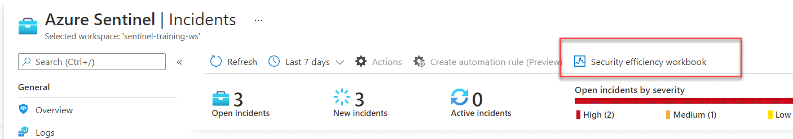

* Through the incident itself, that will open the same workbook on a different tab, and present the information and lifecycle for the given incident.

5. Review the dashboard.

### Exercise 2: Handling Incident **"Sign-ins from IPs that attempt sign-ins to disabled accounts"**

1. Open Azure Sentinel incident page.
2. Locate the incident **"Sign-ins from IPs that attempt sign-ins to disabled accounts"**
3. Press on the incident and look on the right pane for the incident preview, please notice that in this pane we are surfacing the incident entities that belong to this incident.
4. Take ownership on the incident and change its status to **Active**
5. Navigate to incident full details by pressing **View full details** and execute playbook to bring Geo IP data (user will notice tags being added).
6. Navigate to the **Alerts** tab and press the number of **Events**. This action will redirect you to Raw logs that will present the alert evidence to support the investigation

7. In raw log search, expend the received event and review the column and data we received, this properties will help us to decide if this incident is correlated to other events.

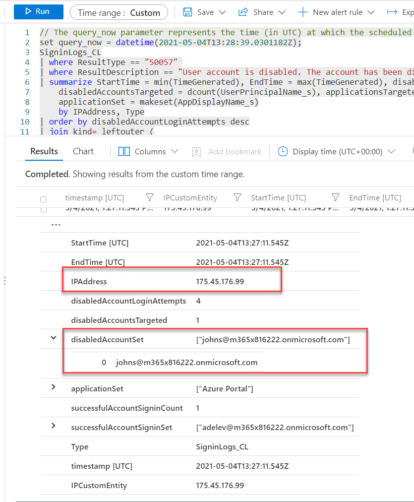

8. To get more context for this IP, we want to add GEO IP enrichment. In a real life SOC this operation will run automatically, but for this lab we want you to run it manually.

* Navigate back to the incident full page to the alert tab and scroll to the right

* To view the relevant automation that will assist us with the enrichment operation, Press **view playbook**

9. Locate the playbook **Get-GeoFromIpAndTagIncident** and press **Run**. If the playbook is configured correctly, it should finish in a couple of seconds.
10. Navigate back to the main incident page and notice to new tags that added to the incident.

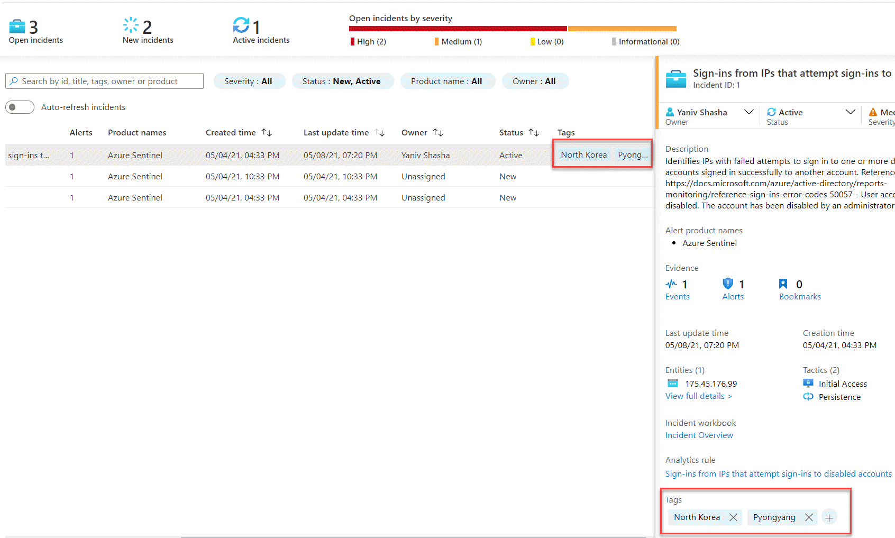

\*\* **Bonus** : Open the resource group for Sentinel deployment, locate the playbook and look on the last playbook run to review the execution steps.

1. As this enrichment information increases your concern, you want to check other traces of this IP in your network. For this investigation you want to use the investigation workbook.
2. In the left navigation press **Workbooks** and select **My Workbooks**

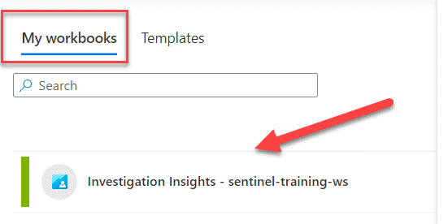

3. To open the **Investigation Insights - sentinel-training-ws** saved Workbook, in the right page press **View saved workbook**
4. Validate that in the properties selector, your workspace is set on **sentinel-training-ws** and the subscription is the subscription that hosts your Microsoft Sentinel Lab.

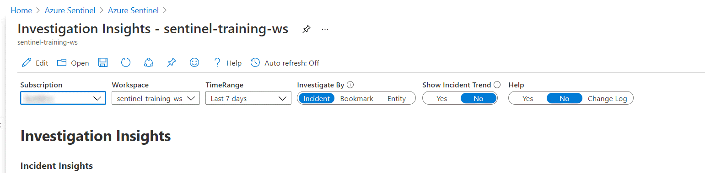

5. As the subject of the investigation is the suspicious IP from North Korea. we want to see all the activity done by this IP so in the properties selector, switch on the **investigate by** to Entity.
6. in the **Investigate IP Address** Tab, add the suspicious IP.

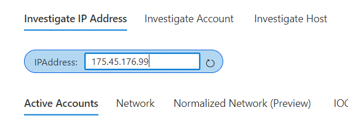

7. Under the activity Detail we see many successful logins from this IP with the user Adele, and also some failed logins to disabled account from last day/hours
8. We copy the User adelev@m365x816222.onmicrosoft.com and validate it in our internal HR system, from the information we collected its seems that Adele is part of the security Red team, and this suspicious is part of the exercise.
9. As the red team exercise discovered by us, the SOC manager ask us to add this IP to the whitelisting IP's, that we will not trigger incident on it any more.
10. On the main incident page, select the relevant incident and press **Actions - > Create automation Rule**

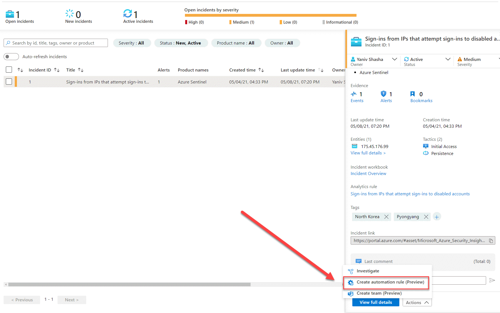

11. In the new screen, we will see all the incident identifiers ( the IP, and the specific Analytics rule), as the Red Team exercise will finish in 48 hr., adapt the rule expiration till the end of the drill, and press **Apply**.

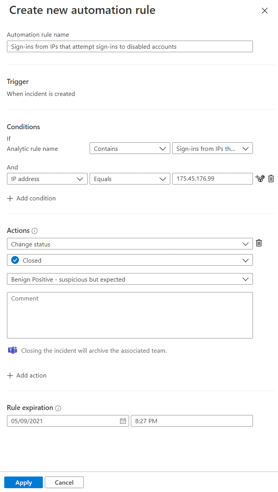

12. As this incident consider as benign, we go back to the main incident page, and close the incident with the right classification.

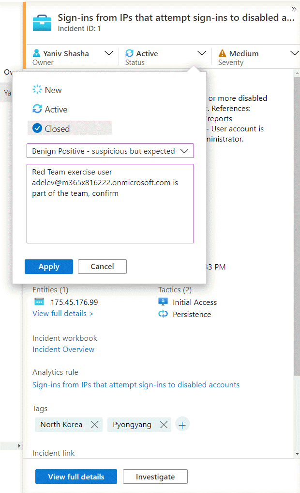 M5-close-incident

### Exercise 3: Handling **"Solorigate Network Beacon"** incident

1. If not already there, navigate to _Incidents_ view in Microsoft Sentinel
2. From the list of active incidents, select "Solorigate Network Beacon" incident. If you can't find it, use the search bar or adjust the time filter at the top. Don't worry if you see more than one.

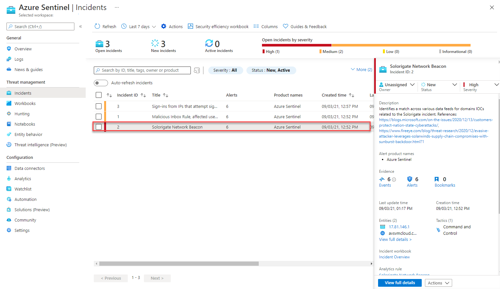

3. Assign the incident to yourself and click _Apply_.

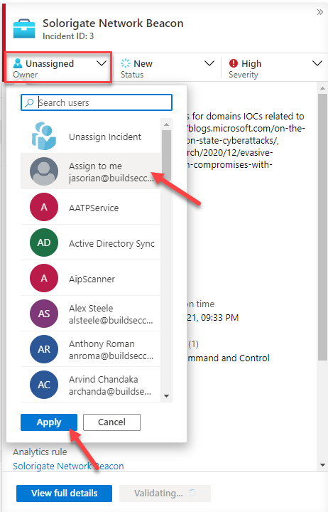

4. Read the description of the incident. As you can see, one of the domain IOCs related to Solorigate attack has been found. In this case, domain **avsvmcloud.com** is involved.
5. Optionally, you can click on _View full details_ to drill down to inspect the raw events that triggered this alert. For that, click on _Link to LA_ as shown in the screenshot:

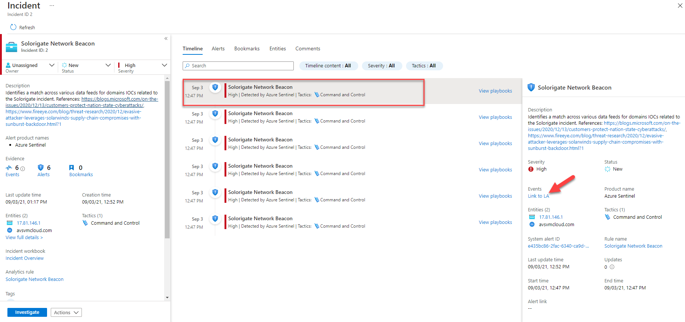

6. As you can see, the events were originated in Cisco Umbrella DNS, and the analytic rule uses _Microsoft Sentinel Information Model_ (ASIM) to normalize these events from any DNS source. Read more about [ASIM](https://docs.microsoft.com/azure/sentinel/normalization) and the [DNS schema](https://docs.microsoft.com/azure/sentinel/dns-normalization-schema).

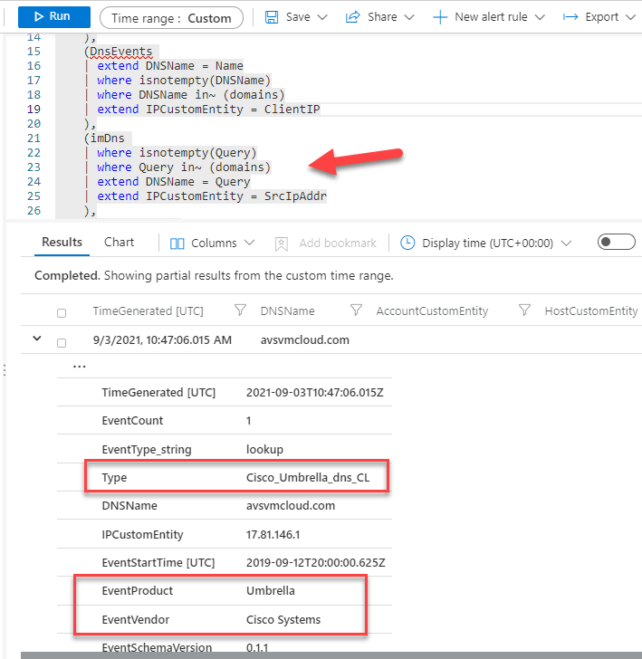

### Exercise 4: Hunting for more evidence

1. As a next step, you would like to identify the hosts that might have been compromised. As part of your research, you find the following [guidance from Microsoft](https://techcommunity.microsoft.com/t5/azure-sentinel/solarwinds-post-compromise-hunting-with-azure-sentinel/ba-p/1995095). In this article, you can find a query that will do a SolarWinds inventory check query. We will use this query to find any other affected hosts.
2. Switch to _Hunting_ in the Microsoft Sentinel menu.

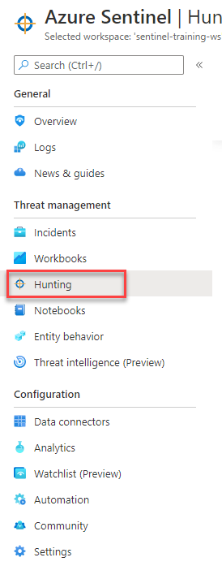

3. In the search box, type "solorigate". Select _Solorigate Inventory check_ query and click on _Run Query_.

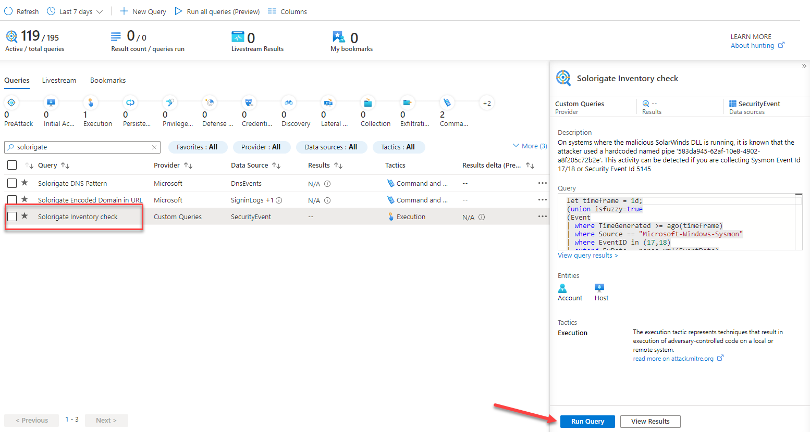

4. You should see a total of three results. Click on _View Results_

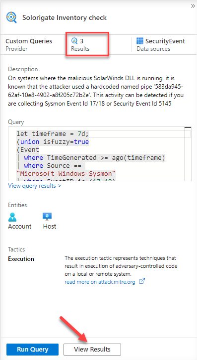

5. As you can see, besides **ClienPC**, there's two additional computers where the malicious DLL and named pipe has been found. Bookmark all three records, selecting them and then click on _Add bookmark_.

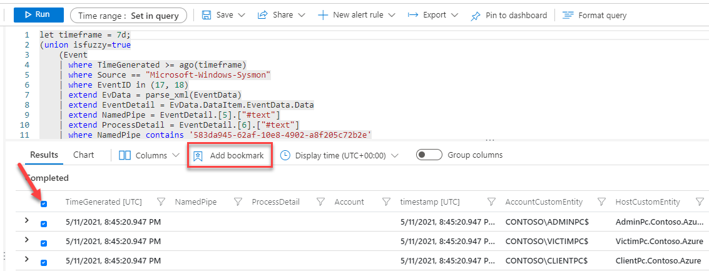

6. In the window that appears click on _Create_ to create the bookmarks. As you can see entity mapping to already done for you.

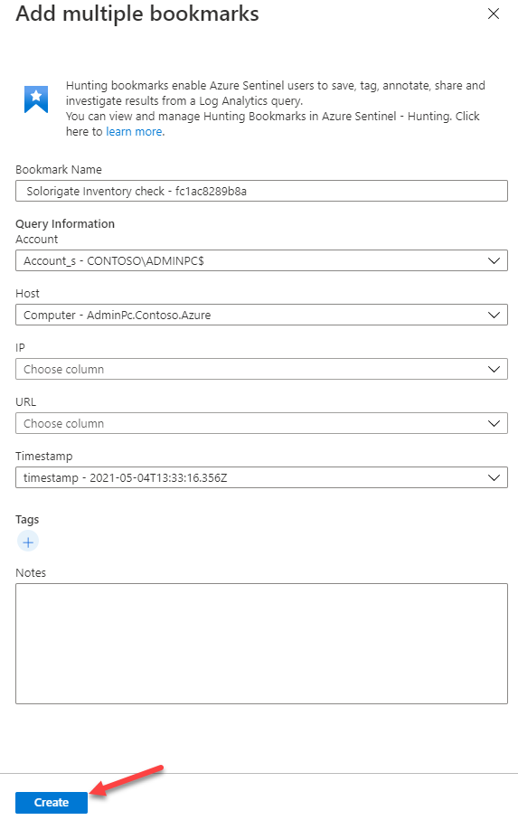

7. Wait until the operation finishes and close the log search using the ✖ at the top right corner. This will land you in the Bookmarks tab inside Hunting menu, where you should see your two new bookmarks created. Select both of them and click on _Incident actions_ at the top and then _Add to existing incident_.

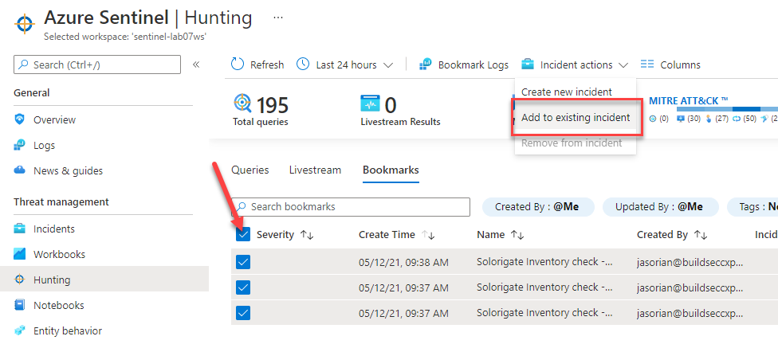

8. From the list, pick the Solorigate incident that is assigned to you, and click _Add_.

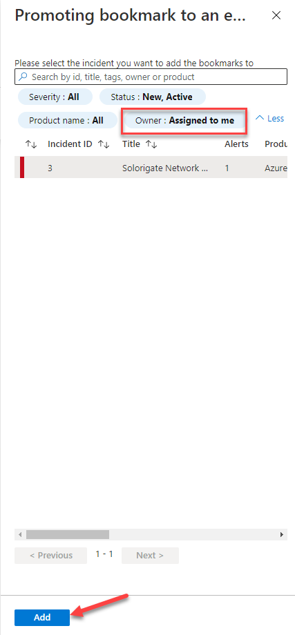

9. At this point you can ask the Operations team to isolate the hosts affected by this incident.

### Exercise 5: Add IOC to Threat Intelligence

Now, we will add the IP address related to the incident to our list of IOCs, so we can capture any new occurrences of this IOC in our logs.

1. Go back to _Incidents_ view.
2. Select the Solorigate incident and copy the IP address entity involved. Notice that you have now more computer entities available (the ones coming from the bookmarks).

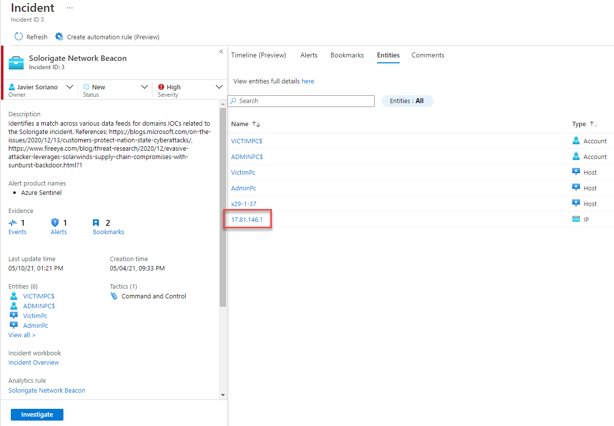

3. Go to the _Threat Intelligence_ menu in Microsoft Sentinel and click _Add new_ at the top.

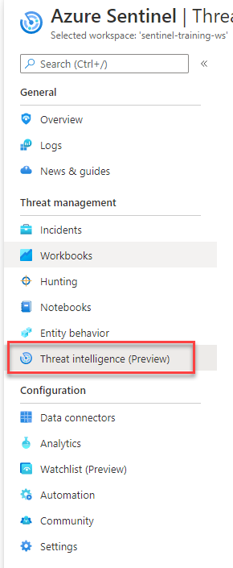

4. Enter the following details in the _New indicator_ dialog, with _Valid from_ being today's date and _Valid until_ being two months after. Then click _Apply_.

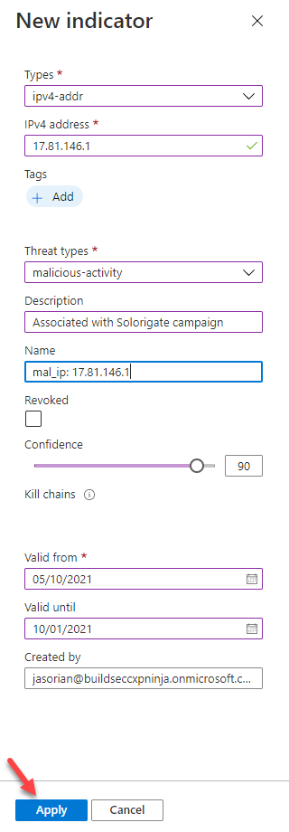

### Exercise 6: Handover incident

We will now prepare the incident for handover to forensics team.

1. Go to _Incidents_ and select the Solorigate incident assigned to you. Click on _View full details_.
2. Move to the _Comments_ tab.

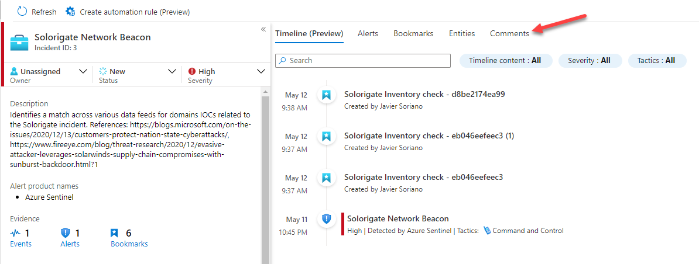

3. Enter information about all the steps performed. As an example:

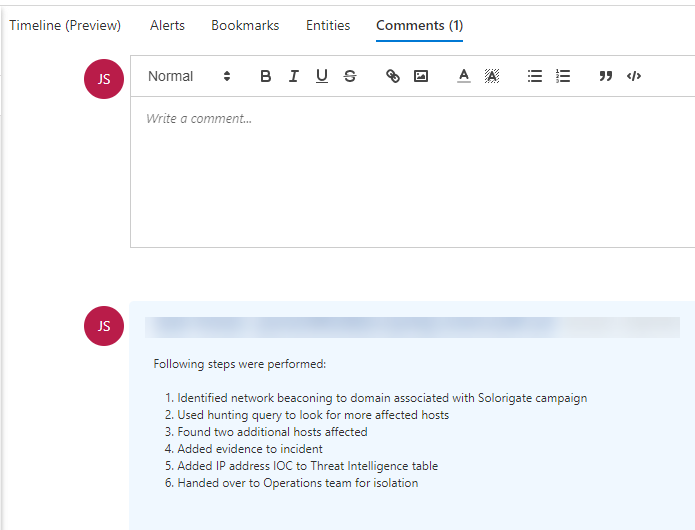

4. At this point you would hand over the incident to forensics team.

You can now continue to [**Module 5 - Hunting**](Module-5-Hunting.md)
