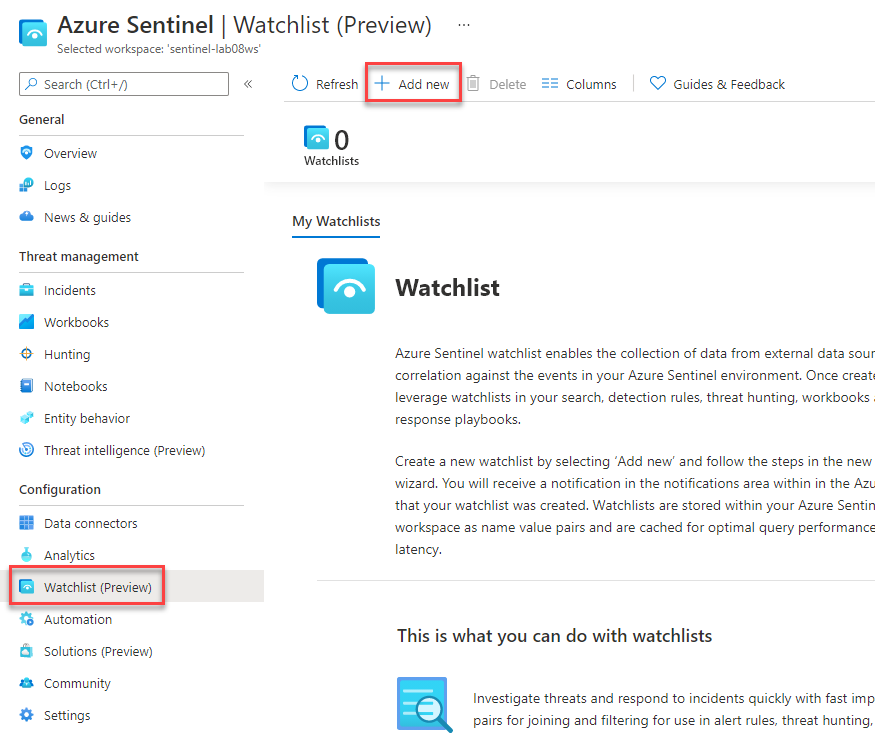
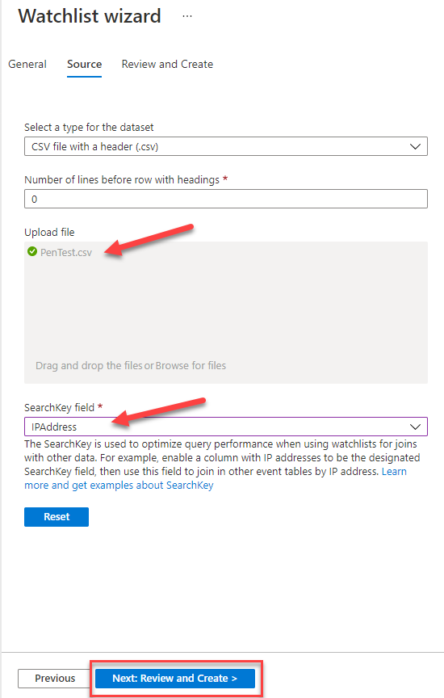
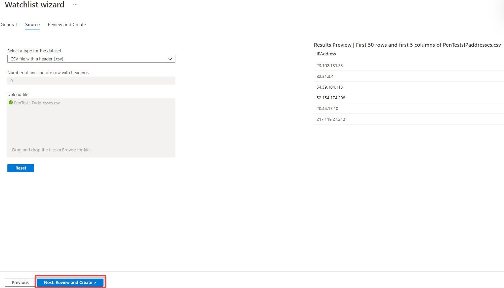
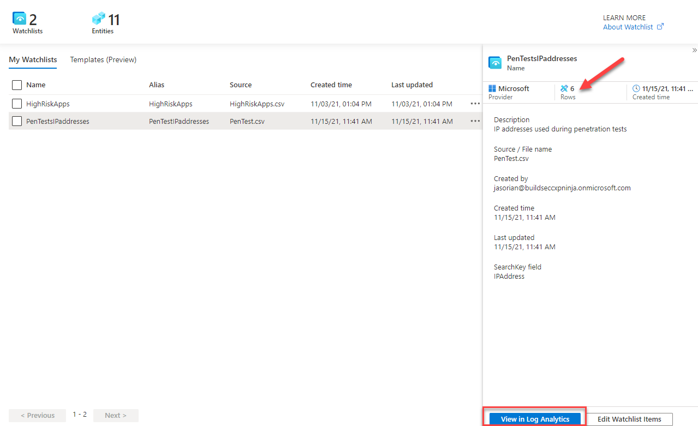
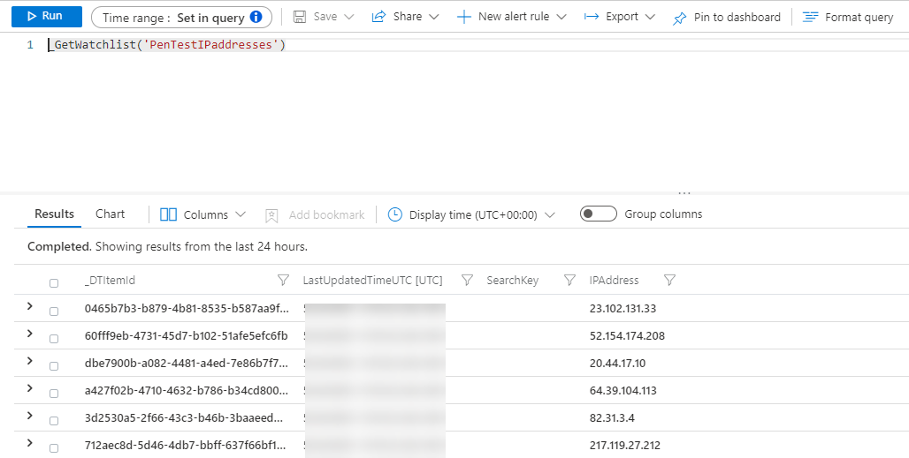
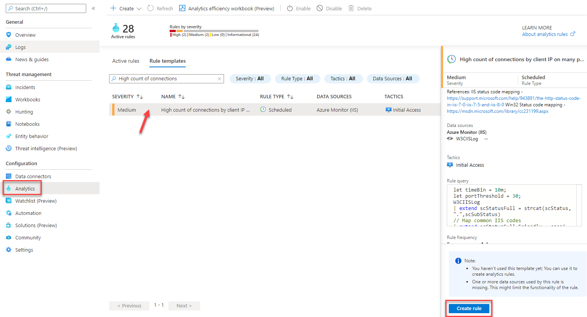
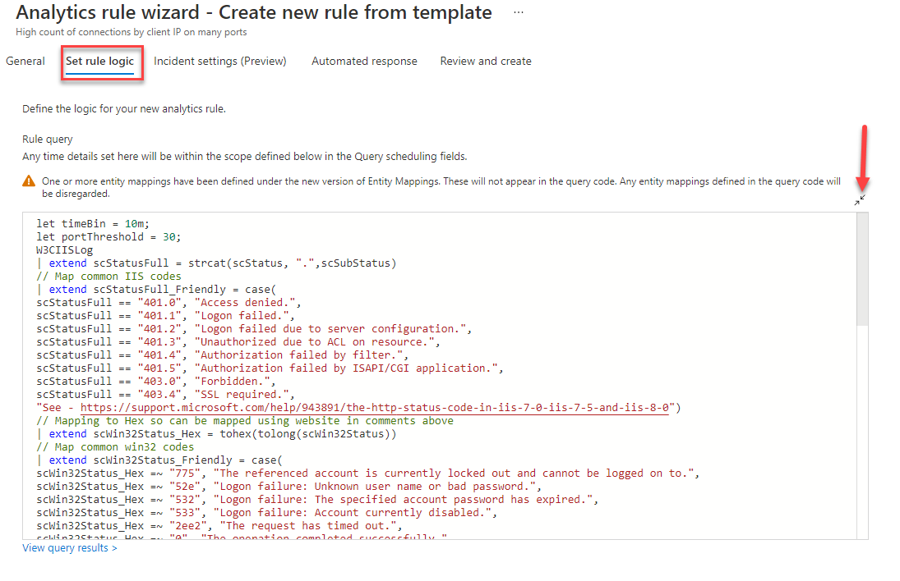
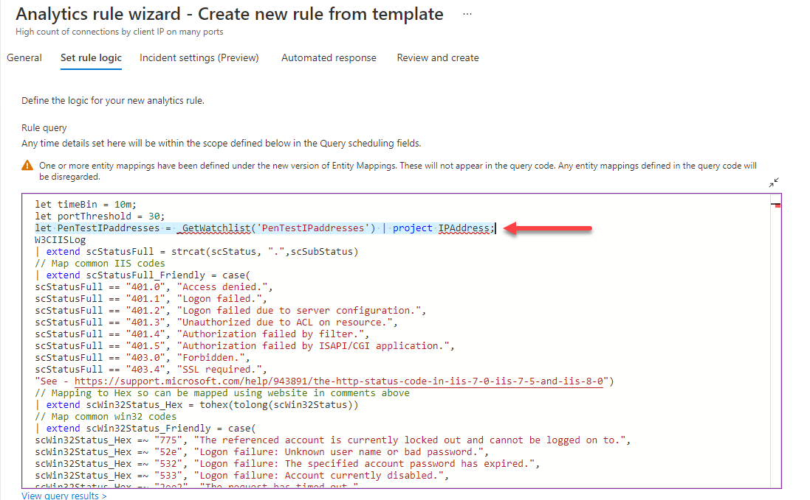
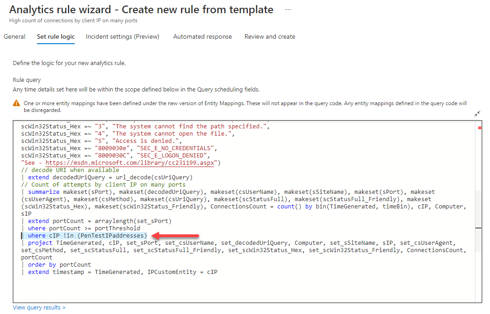
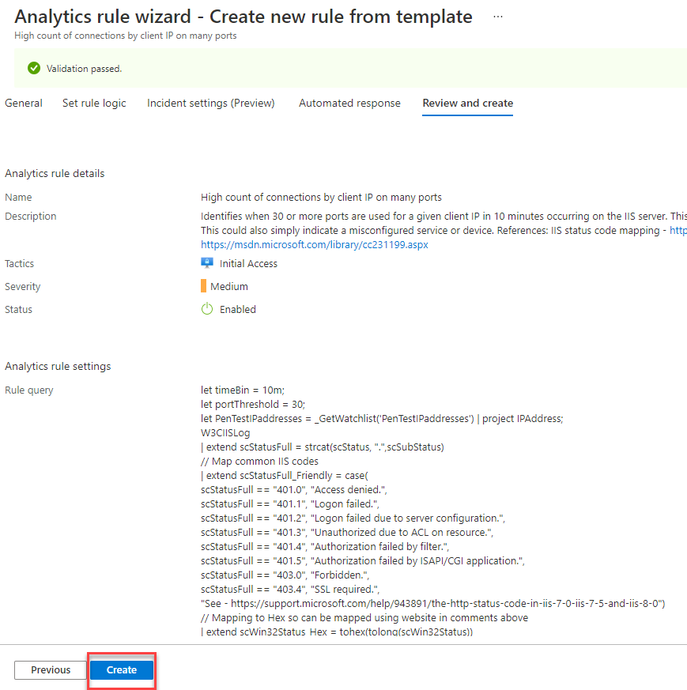

# Watchlists

This module will show you how to use Microsoft Sentinel watchlists in event correlation and enrichment. Once created, you can use watchlists in your search, detection rules, threat hunting, and response playbooks.

#### Prerequisites

This module assumes that you have completed [Module 1](Module-1-Setting-up-the-environment.md), as the data and the artifacts that we will be using in this module need to be deployed on your Microsoft Sentinel instance.

### Exercise 1: Create a watchlist

You have received a message from the SOC manager, informing you about a penetration test exercise being performed over the next few weeks. Your manager also informs you that the SIEM is already seeing a bunch of incidents from IP addresses used by the penetration test team. These incidents all come from rule "High count of connections by client IP on many ports", which identifies when 30 or more ports are used for a given client IP in 10 minutes occurring on the IIS server. Your manager provides you [this CSV file](../Artifacts/Telemetry/PenTestsIPaddresses.csv) with the list of the IP addresses involved in the penetration exercise.

1. From Microsoft Sentinel portal, go to Watchlists menu and click _Add new_.

1. In the watchlist wizard enter the following and click _Next: Source_:
   * Name: **PenTestsIPaddresses**
   * Description: **IP addresses used during penetration tests**
   * Watchlist Alias: **PenTestIPaddresses**
   * SearchKey field: **IPAddress**

1. Download the [CSV file](../Artifacts/Telemetry/PenTestsIPaddresses.csv) to your desktop.
2. In the watchlist wizard, upload the file from your desktop, check the _Results Preview_ and click _Next: Review and Create_.

1. Click _Create_ to finish the wizard.
2. You are brought back to the Watchlists screen, where you see your newly created watchlist. The watchlst data takes about **1 minute** to be available in the workspace. Wait until the **Rows** number changes from 0 to 6. Then click on _View in Log Analytics_.

1. You should see the following screen. From the same logs screen you can also run _\_GetWatchlistAlias_, which will return all defined watchlists.

### Exercise 2: Whitelist IP addresses in the analytics rule

1. Go to _Analytics_, then _Templates_ and search for "High count of connections". Select the "High count of connections by client IP on many ports" rule and click on _Create rule_.

1. In the _Set rule logic_ step of the wizard, expand the query window.

1. Add the following KQL statement that brings the IPAddress field from the "PenTestsIPaddresses" watchlist: _let PenTestIPaddresses = \_GetWatchlist('PenTestIPaddresses') | project IPAddress;_

1. Now add an additional _where_ statement to discard records where the client IP address (cIP field) matches one of the IP addresses in the watchlist. The statement is: _| where cIP !in (PenTestIPaddresses)_

1. Continue through the wizard and save the modified rule.

You can now continue to [**Module 7 - Threat Intelligence**](Module-7-Threat-Intelligence.md)
